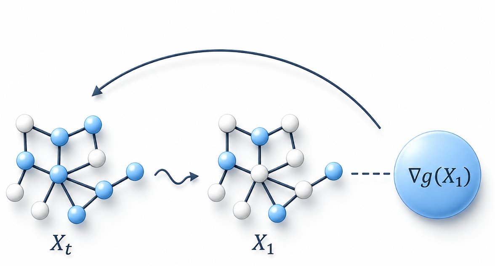

# Combinatorial Adjoint Matching

<p align="center">

</p>

This is the official repo for [Unsupervised Diffusion Solver for Combinatorial Optimization via Combinatorial Adjoint Matching](https://arxiv.org/pdf/2605.30920), ICML 2026. If you have any question, please contact us at: shengyuf@cs.cmu.edu.

## Installation

Install PyTorch matching your CUDA version (example below uses torch 2.11.0 + CUDA 12.8; adjust versions accordingly):

```bash
pip install torch==2.11.0 --index-url https://download.pytorch.org/whl/cu128
pip install pyg_lib torch_scatter torch_sparse -f https://data.pyg.org/whl/torch-2.11.0+cu128.html
pip install torch_geometric
pip install -r requirements.txt
```

## Compilation

Compile the TSP utils:

```bash
cd utils/cython_merge
python setup.py build_ext --inplace
cd -
```

Compile the CVRP utils:

```bash
cd utils/c_classic
make
cd -
```

## Data & Checkpoints

You can download our [data](https://huggingface.co/datasets/shengyuf/CAM_data) & [checkpoints](https://huggingface.co/shengyuf/CAM_models) from huggingface.

To summarize our data sources:
- TSP & MIS (ER): [DIFUSCO](https://github.com/edward-sun/difusco),
- MIS (RB) & MCut: [DiffUCO](https://github.com/ml-jku/DIffUCO),
- CVRP: [ML4CO-Bench-101](https://github.com/Thinklab-SJTU/ML4CO-Bench-101).

Also, you can find the data generators at [FrontierCO](https://github.com/sunnweiwei/FrontierCO/).

## Setup

Edit `scripts/config.sh` to set your data directory and number of GPUs:

```bash
export DATADIR=/path/to/your/data
export PROCESSES=#GPUs
```

## Training

Launch any script directly:

```bash
bash scripts/mis/mis_er_cam.sh
bash scripts/mis/mis_rb_small_cam.sh
bash scripts/mis/mis_rb_large_cam.sh
bash scripts/tsp/tsp_500_cam.sh
bash scripts/tsp/tsp_1000_cam.sh
bash scripts/mcut/mcut_ba_large_cam.sh
bash scripts/cvrp/cvrp_100_cam.sh
```

## Testing

To run inference on **your trained models**, make two changes to the script:
1. Remove `--do_train`
2. Set `--num_processes 1` in `scripts/config.sh` (**important**: ensures fairness in time measurement)

For `mis_er_cam.sh`, if you want to test ER-[9000-11000], you need to set `--num_t 200` and update `--test_path $DATADIR/MIS/ER_large_test`.

You can also specify the `--checkpoint` arg for testing **existing models**, for example:

```bash
--checkpoint CAM_models/mis_rb_small_cam/cam/best.pt
```

## Citation

    @misc{feng2026unsuperviseddiffusionsolvercombinatorial,
        title={Unsupervised Diffusion Solver for Combinatorial Optimization via Combinatorial Adjoint Matching}, 
        author={Shengyu Feng and Tarun Suresh and Yiming Yang},
        year={2026},
        eprint={2605.30920},
        archivePrefix={arXiv},
        primaryClass={cs.LG},
        url={https://arxiv.org/abs/2605.30920}, 
    }

